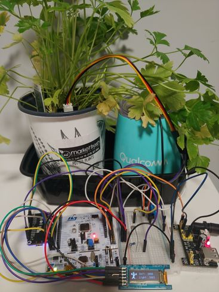
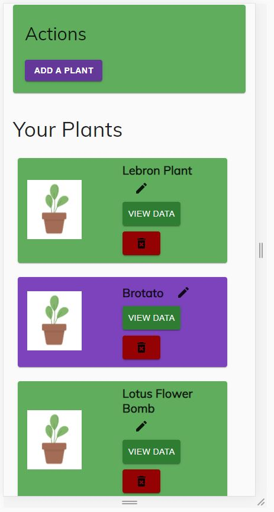
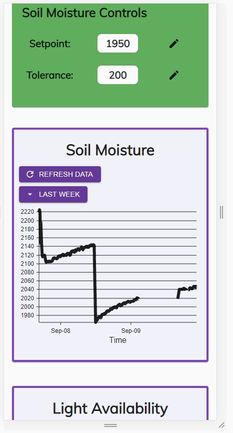
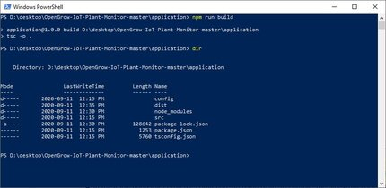
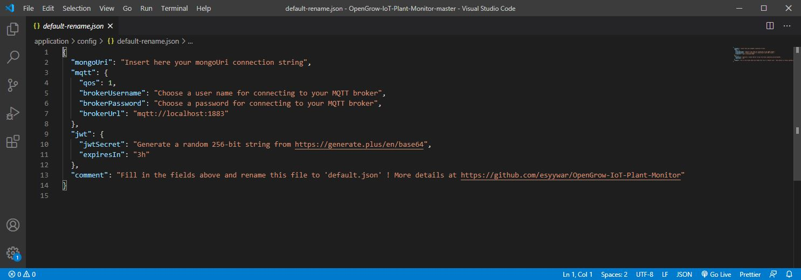
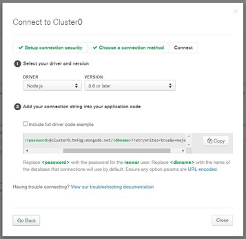
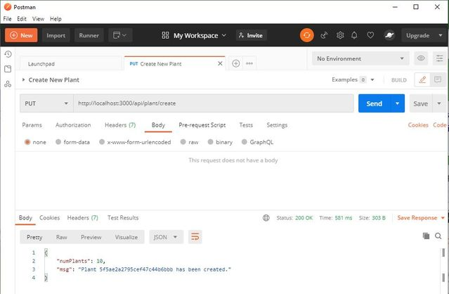

# Welcome to OpenGrow!

OpenGrow is a complete IoT solution for monitoring the soil moisture and light availability for your plants.

Your plant is also automatically watered 24/7 according to soil moisture setpoints which you can set and update at any time!

OpenGrow is easy to set-up and in this guide I will detail the steps to running OpenGrow in your own home.

Program firmware and assemble the circuit | Add plants to your account | Monitor data and update settings
:-------------------------: | :-------------------------:|:-------------------------:
 |  | 

# Table of Contents

1. System Architecture
1. Parts List
1. Web Application Set-Up
1. ESP8266 NodeMCU Firmware
1. STM32F4 Firmware
1. Electrical Schematic
1. Done!

## System Architecture

This complete IoT solution can be broken up into 3 parts:
1. Web Application (MERN Stack Application)
2. MQTT Broker (NodeJS with Aedes Framework)
3. Firmware & Electronics (FreeRTOS on STM32F4 and NodeMCU on ESP8266)

The following diagram illustrates interaction between these components.
 

## Parts List

Following is a list of necessary components to make a single OpenGrow plant monitor. You can make as many plant monitors as you like to work with your single MQTT broker and web application.

| Part  | Quantity | Description |
| -------- | ---- | ---- |
| [STM NUCLEO-STM32F446](https://www.digikey.ca/en/products/detail/stmicroelectronics/NUCLEO-F446RE/5347712) | 1 | Evaluation board for the STM32F446RE processor based on ARM Cortex M4 core. Any STM43F4 series evaluation board will do here. |
| [ESP8266 NodeMCU](https://www.amazon.ca/KeeYees-Internet-Development-Wireless-Compatible/dp/B07PR9T5R5/ref=sxts_sxwds-bia-wc-p13n1_0?cv_ct_cx=esp8266+nodemcu&dchild=1&keywords=esp8266+nodemcu&pd_rd_i=B07PR9T5R5&pd_rd_r=d9a06747-2a73-4f98-997d-a3283c77ed43&pd_rd_w=Oi9SB&pd_rd_wg=K3Prr&pf_rd_p=514ff5bd-659e-4ee0-b4fb-c13ee87c5900&pf_rd_r=DJPP2NATAR8K1WZ9T3HA&psc=1&qid=1599621396&sr=1-1-791c2399-d602-4248-afbb-8a79de2d236f) | 1 | Low-cost wi-fi integated microchip where we can run the NodeMCU firmware framework. |
| [Digilent Pmod OLED: 128 x 32 Pixel Monochromatic OLED Display](https://www.digikey.ca/en/products/detail/digilent-inc/410-222/3902806) | 1 | Not a necessary component but cool to have! Not much trouble to modify code to work with any SSD1306 based display. |
| [Soil Moisture Sensor](https://www.amazon.ca/Gikfun-Capacitive-Corrosion-Resistant-Detection/dp/B07H3P1NRM/ref=sxts_sxwds-bia-wc-p13n1_0?cv_ct_cx=Soil+Moisture+Sensor&dchild=1&keywords=Soil+Moisture+Sensor&pd_rd_i=B07H3P1NRM&pd_rd_r=171d6825-b117-4254-be30-a854bf504427&pd_rd_w=bHSon&pd_rd_wg=wgCQb&pf_rd_p=514ff5bd-659e-4ee0-b4fb-c13ee87c5900&pf_rd_r=E74F8BTWB8JX747Z8NW8&psc=1&qid=1599621476&sr=1-1-791c2399-d602-4248-afbb-8a79de2d236f) | 1 | Capacitive soil moisture sensor which outputs an analog voltage signal. |
| [Submersible Water Pump](https://www.amazon.ca/WayinTop-Submersible-Flexible-Fountain-Aquarium/dp/B07TMW5CDM/ref=sr_1_15?dchild=1&keywords=submersible+water+pump+3-5v&qid=1599621498&sr=8-15) | 1 | Pushes water from an outlet where we attach some tubing leading into the potted plant. |
| [3.3V and 5V Regulator Board](https://www.amazon.ca/UCEC-Breadboard-Supply-Arduino-Solderless/dp/B074113L8F/ref=sr_1_18?dchild=1&keywords=3.3v+5v+regulator+board&qid=1599967777&sr=8-18) | 1 | Provides 5V to nucleo board and 3.3V to power pump. This is not a necessary component but makes it simpler to follow my provided wiring schematic. You have plenty of options for power and really only need 3.3 V to power the STM32, ESP and pump (with at least 700 mA). 
| 2N222A BJT* | 1 | Very popular and cheap transistor to switch our pump. |
| 330 Ohm Resistor* | 1 | Placed at base of the transistor used to toggle the pump. |
| Photoresistor* | 1 | Resistance of this component is proportional to ambient light. |
| 10 Kiloohm Resistor* | 1 | Used to create a voltage divider with the photoresistor where we can take analog voltage reading. |

*[A small kit like this](https://www.amazon.ca/Kuman-Electronic-Raspberry-Breadboard-Potentiometer/dp/B01IGGP7Z2/ref=sr_1_14?dchild=1&keywords=kuman+tech+kit&qid=1599621601&sr=8-14) is the best option for the last 4 components in this list.

## Web Application Set-Up

### Tech Stack

This full stack web application can be separated into the front-end and back-end. 

The front-end is built with React Js framework, styled with Material UI and uses Redux for state management.

The back-end is built with Node Js and the express framework.

### Installing Dependencies

Before proceeding, make sure that you have [installed Node Js installed on your machine](https://nodejs.org/en/download/).

1. Copy the repository to your machine and use command prompt to enter the 'application' directory.
1. Enter the application directory and run the command 'npm install' to install the necessary back-end dependencies from node.
1. From application directory enter src>client and run the command 'npm install' to install the front-end dependencies.
1. In the application folder run the command 'npm run build' to compile the typescript code into javascript we can run in a browser.

Your directory should appear as below when all is installed:

### Filling Config Options

Navigate to application>config and open the 'default-rename.json' file. You will need to fill some parameters in this file to get up and running.

When you are done, you must remember to **rename this file to 'default.json'!!**

#### Mongo URI 

First is the 'mongoUri' field. Your application needs a database to connect to and we must provide it here. Go to [MongoDB's website](https://www.mongodb.com/) and sign-in or create an account. You just need to create a free database for OpenGrow. There are many ways to do this (using Atlas, command line tool, mongoDB website).

When you have created a database, you can get a connection string that looks something like this:

Simply copy and paste this string into the 'mongoUri' value field of config.json.

#### MQTT

Under MQTT file, choose a quality of service (qos) for messages sent by your web-application. You can read about this MQTT setting [here](https://www.hivemq.com/blog/mqtt-essentials-part-6-mqtt-quality-of-service-levels/).

Now choose a username and password for your MQTT broker. You may choose whatever you like. We must only make sure to give the same credentials when flashing firmware for the ESP8266 so it can connect!

Lastly, the URL for your MQTT broker which your web application uses to connect. In the file application>src>mqtt-broker>broker.ts the MQTT broker is set to run on local machine at port 1883. If you change this or run your broker elsewhere (maybe on a raspberry pi server?), make sure to update this URL.

#### JWT

The web-application allows multiple user accounts which are password protected. Json-web-tokens are used for authentication.

Follow the URL in the 'jwtSecret' field value to create an encryption string and add it.

Lastly, choose how long you want a user's login to remain valid before they need to login again. Default here is filled as '3h' (3 hours).

#### Run The Application and Create Plants

You are all set-up! Simply navigate into the 'application' folder and run the command 'npm run dev' to launch OpenGrow.

Now it is important to populate some plants in our database. To do this, make a put request to the route 'http://localhost:3000/api/plant/create'. We can use a service like [Postman](https://www.postman.com/) to do this. The response to our request includes ID of the new plant and the number of plants in our database. We will pass these IDs to our ESP firmware to identify our plants.

## ESP8266 NodeMCU Firmware

Navigate into the 'esp8266' folder of this repo for details on uploading the ESP8266 NodeMCU firmware.

## STM32F4 Firmware

Navigate into the 'stm32_rtos' folder of this repo for details on uploading the STM32F4 FreeRTOS firmware.

## Electrical Schematic

## Done!

Power-up your OpenGrow system and you are ready to go! 

The blue LED on the ESP will blink slowly to indicate it is connected to your MQTT broker and logging data.

To support this project and future open source projects, consider [buying me a pizza!](https://www.buymeacoffee.com/esyywar)

