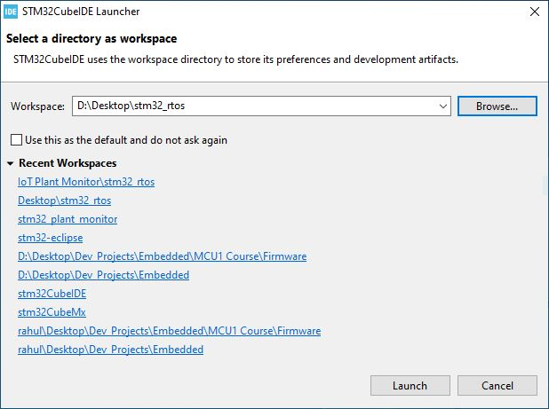
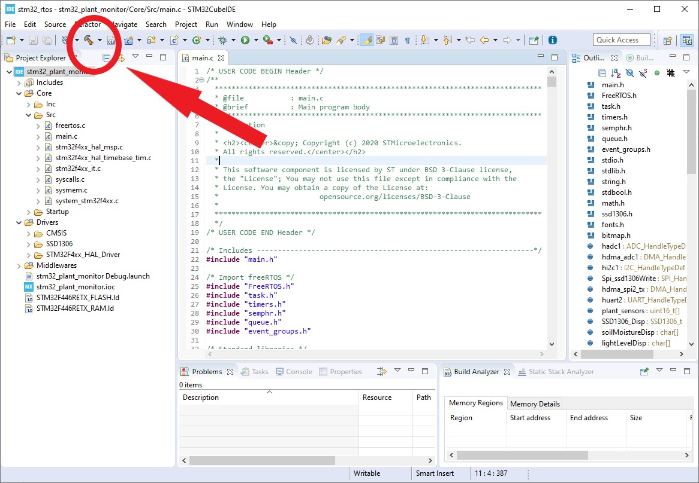
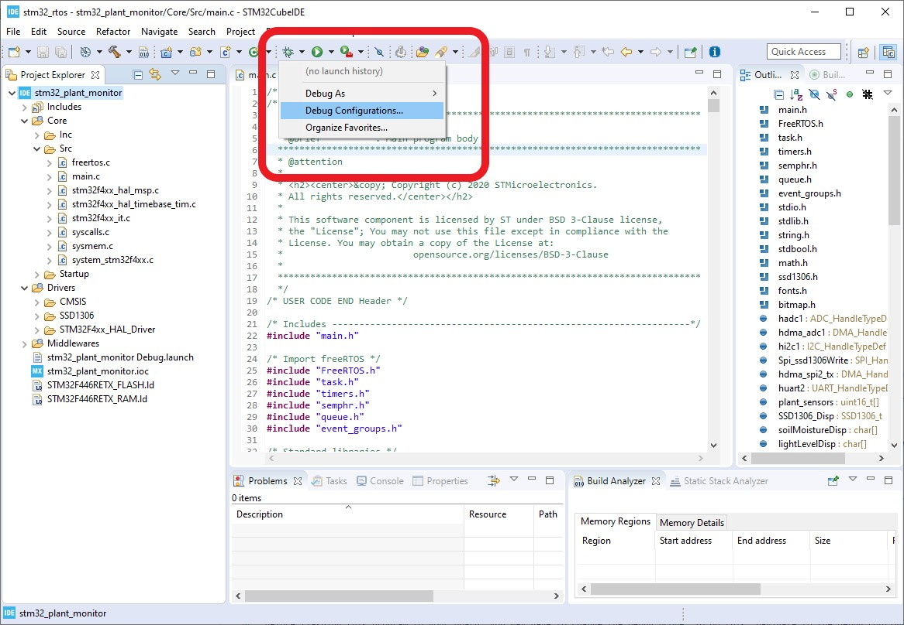
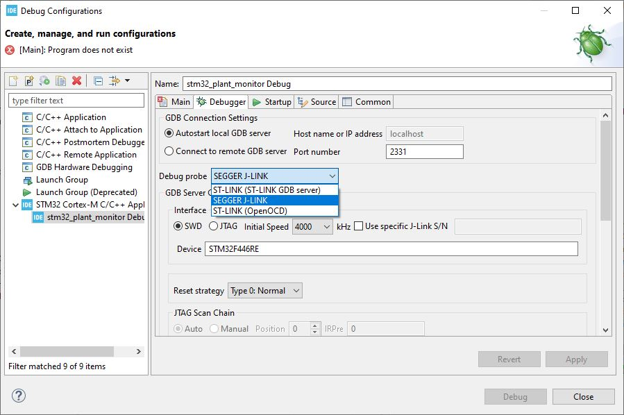
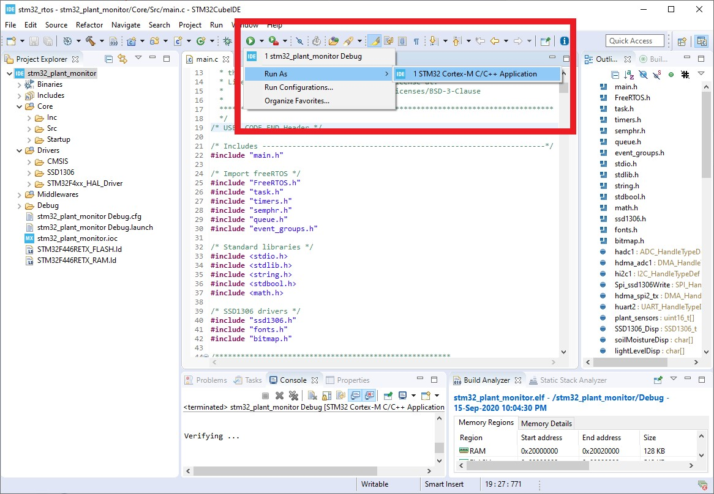

## STM32 Firmware Description

The STM32 firmware runs a real-time application built on the FreeRTOS kernel. 

The STM32F4 HAL (hardware abstraction layer) API is also used.

There are separate tasks used for: 
1. Write operations to the OLED display
1. Reading data values from sensors
1. Watering the plant according to a PID controller formula

**Note:** For the OLED screen display, I have modified existing drivers for SSD1306 based displays to be RTOS safe. The drivers run without blocking so complications associated with write operations being interrupted by context switching are avoided. The SSD1306 drivers are separately available [here](https://github.com/esyywar/ssd1306_drivers).

## STM32CubeIDE

The project is this repo is built with the STM32CubeIDE development platform. This SDK is ST's adaptation of the popular open-source Eclipse IDE. 

STM32CubeIDE is simply a free Eclipse based platform where the GCC toolchain, GDB debugger and other configurations are set for compatibilty with STM32 processors. This saves time and effort for the developed in setting up the environment.

To open the project in this repo and flash the firmware to your STM32F4 device, first [download the STM32Cube IDE](https://www.st.com/en/development-tools/stm32cubeide.html).

## Flashing STM32 Firmware

To open the project with STM32CubeIDE, you should open the '.cproject' file in this folder. A window will pop up asking to set the project workspace. You should choose the 'stm32_rtos' folder as this workspace directory.

For example, if you have downloaded the repo to your desktop, you should choose your workspace folder as follows:

Now with the project open, try compiling by clicking the hammer icon to build the project. Everything should compile without any warnings or errors.

Before flashing this program to your board, you may have to change the debug probe. To do this, navigate to the debug configurations and look under the project's debug configurations. This menu option appears after clicking the drop-down next to the bug icon on the toolbar.

The STM32F4 boards are ready out of the box with the ST-LINK (GDB) debug interface. Conversely, you might have converted the on-board ST-LINK to a J-LINK interface. Choose the appropriate debug probe from the drop down menu.

## Complete

That is all! Flash the firmware to the board by entering the debug mode or by running the program as a STM32 Cortex-M application as in the image below.

